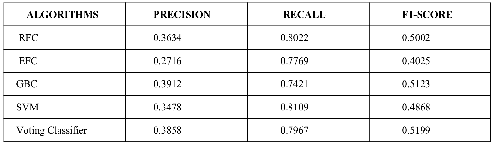

## Problem Statement : Marketing Analytics

[ML - Developer Coding Problem 2017.pdf](https://github.com/Saurav0074/Fragma-Coding-Assessment/blob/master/ML%20-%20Developer%20Coding%20Problem%202017.pdf) contains the original description of the problem that was assigned to me while applying for the **Selection towards Developer Position - 2017** at [Fragma Data Systems](https://fragmadata.com/).
### Note: I was, however, ineligible for the job position because of the requirement of joining immediately _( Still in my senior year :-( )_.

[marketing-data.csv](https://github.com/Saurav0074/Fragma-Coding-Assessment/blob/master/marketing-data.csv) contains the data set of direct marketing campaigns of a banking institution. [main.py](https://github.com/Saurav0074/Fragma-Coding-Assessment/blob/master/main.py) contains the complete code.

### Data Exploration
- Looking at the values of the columns, the first task needed to be carried was to convert the columns with
non-numeric/string values into numeric ones. I used sklearn’s `LabelEncoder()` function for this. Below is an overview of the labelling function used:

```
# function to encode non-numeric values into set of numeric labels
def encoding_columns(X):
	encoder = LabelEncoder()
	encoder.fit(X)
	X = encoder.transform(X) # transform X based on distinct labels found
	#print(format(Counter(X))) # print count of each label
	return X

```
### Feature Engineering
- The given data contains 16 attributes as feature sets and the last column as the output label. The features were first normalised using `MinMaxScaler()` to scale all of them down to 0-1 range for a better fit with the assumptions of the hyperparameters of the training algorithms. In order to remove any correlated features, **Principal Component Analysis (PCA)** was used which gave best results with a total of 14 best features, i.e., two of the features being highly correlated.
```
	# Scale the features to 0-1 range
	scaler = MinMaxScaler()
	X = scaler.fit_transform(X)

	# Principal Component Analysis for find top 14 uncorrelated features
	pca = PCA(n_components=14)
	X = pca.fit_transform(X)

```
- Studying the labels of client’s subscription for the product shows that the data given contains `37,000`
instances with label **no** while a mere `6,000` instances with label **yes**. So, this clearly identifies that the
data suffers from the infamous **class-imbalance problem**.
- In order to cope with the class-imbalance problem, two measures have been taken:
1. The data is first splitted into train and test sets in the ratio 75:25. **Synthetic Minority Over-sampling
Technique (SMOTE)** is then applied on the so-formed train set to equalize the instances of positive _(“yes”)_
and negative _(“no”)_ classes. **SMOTE** is applied independently to the train set after the split.

2. Since, the test data still suffers from class-imbalance problem, using the traditional **AUC-ROC score** for
evaluating the performance of the binary classifiers would not be sufficient. So, the weighted
**Precision-Recall-Fscore** metric is used for evaluating the performance of the models.

## Model Selection
- After naively experimenting with various binary classifiers, I found the following four giving the best F1
scores (a combined measure of Precision and Recall scores): **Random Forest Classifier**, **Extra Trees
Classifier**, **Gradient Boosting Classifier** and the **Support Vector Machine (SVM) based Classifier**.

## Hyper-parameter Tuning
- **Grid Search algorithm with cross-validation** was used to tune the parameters of the models selected.
```
############### Grid Search based parameter tuning ###################
def tune_parameters(alg, X, y):
	'''
	# Parameter sets for Gradient Boosting Classifier
	parameters = {'loss': ['deviance', 'exponential'],
					'learning_rate': [0.1, 0.3, 0.5, 0.08],
					'n_estimators': [100, 125, 150, 200],
					'min_samples_split': [2, 3, 5],
					'min_samples_leaf': [1, 5, 8]
					}
	
	# Parameter sets for Random Forest and Extra Trees Classifier
	parameters = {'n_estimators':[10, 12, 15, 20],
				'max_features':['log2', 'sqrt', 'auto'],
				'criterion': ['entropy', 'gini'], 
				'max_depth':[2, 3, 5, 10],
				'min_samples_split': [2, 3, 5],
				'min_samples_leaf': [1,5,8]
				}
	'''
	# Parameter sets for SVM
	parameters = {'C':[0.6, 0.8, 1.0, 1.2, 1.4, 1.6]}

	grid = GridSearchCV(alg, parameters, cv = 10, 
						verbose = 0, scoring = 'f1_weighted')
	grid.fit(X, y) # check the combination of parameters on train set

	print("Best F1 score while running Grid Search:", grid.best_score_) # best score obtained
	print("Best parameters found by Grid Search:\n", grid.best_params_) # parameters delivering the best score
```
- The code snippet below shows the hyperparameters selected for each algorithm:
```
	# algorithms with parameters obtained from Grid Search tuning
	alg1 = ExtraTreesClassifier(max_depth=10, n_estimators=20, 
								max_features='auto',
								criterion='gini',
								min_samples_split=2,
								min_samples_leaf=1)
	alg2 = RandomForestClassifier(max_depth=10, n_estimators=20, 
								max_features='sqrt',
								criterion='gini',
								min_samples_split=2,
								min_samples_leaf=1)
	alg3 = GradientBoostingClassifier(loss='deviance', min_samples_split=2,
								min_samples_leaf=5,
								learning_rate=0.5,
								n_estimators=200)
	alg4 = SVC(C=1.2, probability=True)
	
```
### Ensembling of Models
- I used scikit-learn's `Voting Classifier()` to create a voting of the results of the above classifiers in order to observe any boost in the F1-scores. The accuracy reports of individual classifiers as well as the voting of the classifiers with respect to the positive class is shown below:


